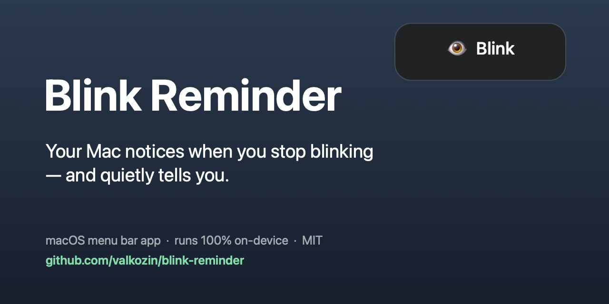
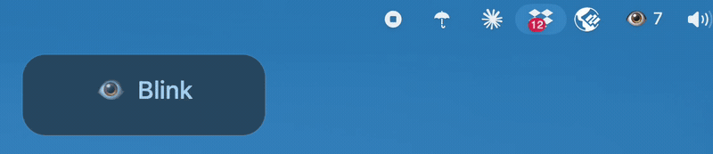

<p align="center">
  
</p>

<p align="center">
  <a href="https://github.com/valkozin/blink-reminder/actions/workflows/tests.yml"></a>
  
  
  
  <a href="LICENSE"></a>
</p>

# Blink Reminder

When you concentrate on a screen you blink far less than usual, and by evening your eyes are
dry and tired. **Blink Reminder watches your blink rate through the webcam and, when you really
have stopped blinking, plays a soft sound and shows a small hint over whatever you are doing.**
It lives in the menu bar, keeps out of the way when you step away, and never sends a single
frame anywhere.

<p align="center">
  
</p>

```bash
git clone https://github.com/valkozin/blink-reminder.git && cd blink-reminder && ./install.sh
```

**Not another 20-20-20 timer.** A timer nags you on schedule whether you need it or not. This
counts actual blinks, measured against your own eyes, and stays silent while you are blinking
normally. When it cannot measure — you turned away, the camera cannot see your eyelids — it
says so and stops, instead of guessing.

**Private by construction.** The app opens no network connections at all: the landmark models
ship inside the Python package, camera frames never touch the disk, and the only files written
are your settings and a per-day count of blinks in `~/Library/Application Support/BlinkReminder/`.
It needs the internet exactly once, during `./install.sh`, to download its libraries.

## What it does

- **Detects real blinks**, not a fixed timer, using MediaPipe's refined face mesh. The
  measurement is calibrated against your own eyes over the last few seconds, so glasses,
  lighting, distance and posture are all divided out.
- **Reminds you gently**: a short system sound (default: `Tink`, at 35% volume) plus a small
  translucent hint that floats above every window and every Space, full-screen apps included.
  Never more than twice a minute, however hard you stare.
- **Pause whenever you want** — a toggle in the menu, or a timed pause of 15/30/60 minutes.
- **Pauses itself** when the screen is locked, when the display sleeps, and — optionally — when
  the keyboard has been idle for a while.
- **Stands by when you leave.** If your face is out of view for a minute and a half, the camera
  is released (green light off, no CPU) and only reopened when you are back.
- **Starts at login** via a launchd agent, from the menu or the command line.
- Interface is English or Russian, picked from the system language.

Measured cost on an M1 Pro: about 27% of a single core (≈2.5% of the machine) and 290 MB while
it is actually watching you — roughly a third of that is the camera pipeline itself, which is
why the app releases the camera the moment you leave the desk. Frames are captured at 720p,
shrunk to 480×360 for the landmark model and analysed 15 times per second; nothing is rendered.
Dropping `fps` in the settings file trades detection for battery — the camera pipeline costs
about 9% of a core whatever you do, and each frame per second adds roughly 1.2% on top.

## Install

Requires macOS and Python 3.9–3.12 (MediaPipe has no 3.13+ wheels yet). If you have neither,
`install.sh` fetches a private interpreter through [uv](https://docs.astral.sh/uv/).

```bash
git clone https://github.com/valkozin/blink-reminder.git
cd blink-reminder
./install.sh
```

The app is installed into `~/.local/share/blink-reminder/venv`, deliberately outside the source
folder, so it keeps working if you move, rename or cloud-sync the repository.

The installer offers to register the login item and start the app straight away — say yes.
macOS then asks for camera access; click **Allow**. An eye appears in the menu bar.

> **Why that order matters.** Camera permission on macOS is granted to whatever process asks
> for it. Letting the launchd agent ask means the answer is recorded for exactly the process
> that will run at every login. If you start the app from a terminal instead, the permission is
> recorded for your terminal, and the login agent will have to ask a second time later.

To remove everything again: `./uninstall.sh`. To keep the app but drop the login item, untick
**Start at login** in the menu (or run `blink-reminder --uninstall-autostart`).

## Using it

Click the eye in the menu bar:

| Menu item | What it does |
|---|---|
| *Watching your blinks* | Current state, and the blink rate over the last minute (15–20/min is healthy) or a warning that blinks are barely visible |
| *No blink for 4 s of 12* | What the app is waiting for right now, counting live — including the quiet period after a reminder |
| **Pause / Resume** | Stops the reminders and closes the camera; survives a restart |
| **Pause for…** | 15, 30 or 60 minutes, then it resumes by itself |
| **Remind after…** | 6–30 seconds without a blink (default: 12) |
| **Sound** | Eight short system sounds, volume, or silent |
| **Show on-screen hint** | The floating hint, on or off |
| **Detection sensitivity** | Raise it if light blinks are missed, lower it if squinting is counted |
| **Camera** | Pick a camera, or open **Check camera framing…** to aim it and watch blinks register |
| **Next to the menu bar icon** | Nothing, the blink rate, or a live blink counter (it rolls over at a hundred to keep the menu bar narrow; the running total is in the menu) |
| **Pause when keyboard is idle** | Off by default — reading without touching the keyboard still counts as screen time |
| **Pause when screen is locked** | On by default |
| **Start at login** | Installs/removes the launchd agent |
| **Today’s statistics…** | Screen time, blinks, average rate, reminders |

Menu bar icon: 👁 watching · ⏸ paused · 💤 standing by · 🙈 the camera cannot see you, or can
see you but cannot measure blinks · ⚠️ camera problem.

When the app has something to say on its own — it cannot see you, or cannot see you blink — it
says it the same way it reminds you: a hint that fades on its own, at most once an hour. Never a
dialog. Dialogs wait for a click, and the one thing you can be sure of when the camera cannot
find your face is that nobody is sitting there to click.

**The app stops reminding you when it cannot measure.** Nobody goes two minutes without
blinking, so if a face is in frame and not one blink is measurable in all that time, the eyelids
are hidden by the camera angle. Reminders would be guesswork, so they are suspended until a real
blink is seen again and the menu says why.

### Point the camera at your face

This is the one thing that has to be right, and it is easy to get wrong: if your main screen is
an external monitor and the laptop sits beside or below it, its camera sees the side of your
head, not your eyes. MediaPipe then finds no face at all, the countdown is suspended, and the
app looks broken — sometimes silent for minutes, sometimes reminding you the moment you glance
over. The menu bar switches to 🙈 when that is happening, and after a few unseen minutes at the
keyboard the app says so outright.

Open **Camera › Check camera framing…** and move the camera (or yourself) until the border
around the preview turns green and dots appear on your eyes. That preview keeps running even
while the app is paused, so you can aim it whenever.

The window also shows the detection as it happens: a counter in the corner, the live EAR
against the blink threshold on a bar at the bottom, and a green flash reading `BLINK -47%` each
time one is registered. That percentage is the useful number — a well-aimed camera puts real
blinks at 35–60% below the baseline, and if yours only ever reach 10–20%, move the camera
rather than the sensitivity slider. For a permanent check without opening anything, set
**Next to the menu bar icon** to the blink counter and watch it tick up as you blink.

### If the reminders feel wrong

**A reminder arrives, then the same wait produces nothing.** There is a floor between
reminders — twice the interval, at least 20 seconds — so the app cannot nag while you are
blinking normally but it happens to miss a couple. The third line of the menu counts that quiet
period down, so you can always see whether it is waiting on you or on itself.

Check the menu first: **Remind after…** may be set to 6 seconds, which nudges you as often as
that floor allows. 12 is the default and 15–20 is gentle.

If it seems to miss blinks, record a trace and look at the numbers rather than guessing — see
*Development* below. On a well-aimed camera a real blink shows as a 35–60% drop below the
baseline; if the deepest dip in a whole minute is 10–15%, the camera angle is the problem, not
the threshold.

### When the icon is not there

macOS packs menu bar icons from the right, and when they run out of room it parks the leftmost
ones *underneath the notch*, where they report themselves visible but cannot be seen or clicked.
Unplugging an external display is enough to trigger it: the built-in menu bar is shorter and has
a notch in the middle. `blink-reminder --status` says so outright, with the coordinates.

There is no fix from inside the app — an `autosaveName` and a preferred-position default, which
is how a user-dragged position is normally remembered, do not persist for a process without a
bundle identifier, and setting them stopped the item being placed at all. What works is freeing
room to the right: System Settings › Control Center, set one or two of AirDrop, Bluetooth, Now
Playing or Display to "Don't show in Menu Bar" (each is worth 30–40 points, and `--status`
prints how many are needed). Setting **Next to the menu bar icon** to *Nothing* makes this one
as narrow as it goes.

Either way the icon is not the only way in. Everything the menu does is also a command:

```bash
blink-reminder --status     # what it is doing right now
blink-reminder --pause 30   # or --pause for no time limit
blink-reminder --resume
blink-reminder --quit       # stops it; it returns at your next login
blink-reminder --start      # start it again without logging out
blink-reminder --menubar none|rate|count   # narrow the icon, or put the counter back
```

A pause is remembered on disk, so a crash, an update or a login does not quietly cancel it —
the remaining time is restored too. Settings changed from the terminal are applied to the
running app straight away; there is nothing to restart.

To get the icon back on a crowded menu bar: hold ⌘ and drag icons to reorder them, so this one
sits to the left of whatever is being cut off, or set **Next to the menu bar icon** to *Nothing*
to make it as narrow as possible.

### Command line

```bash
blink-reminder                      # menu bar app
blink-reminder --headless           # terminal only, no menu bar
blink-reminder --interval 15 --sound Purr --save
blink-reminder --install-autostart  # or --uninstall-autostart
blink-reminder --reset-config
blink-reminder --diagnose 20         # live detection numbers, to check the camera
blink-reminder --no-sound --no-hud --camera 1 --save   # one-off overrides; --save keeps them
blink-reminder --version
```

Settings live in `~/Library/Application Support/BlinkReminder/config.json` and hold a few knobs
that are not in the menu (`camera_index`, `fps`, `absence_timeout`, `hud_position`, `language`).
Lowering `fps` costs accuracy, because a blink lasts about 150 ms and is caught in one or two
frames as it is; halving the rate loses roughly a quarter of them. `process_width` is what
reaches the landmark model — below 480 px blinks stop being resolved, and above it nothing
improves.
Logs go to `~/Library/Logs/BlinkReminder.log`.

## How it works

Three measurements, each chosen by recording the camera and comparing alternatives on the same
frames rather than by intuition.

**The signal.** Six eyelid landmarks per eye (three upper/lower pairs) give the gap between the
lids, divided by the distance between the outer corners of the two eyes. The textbook Eye Aspect
Ratio divides by the width of the *same* eye instead, which is a short span between two jittery
landmarks that also shrinks whenever the head turns — a blink that never happened. The distance
between the eyes is several times longer and far steadier.

**The refined mesh.** MediaPipe can run a dedicated high-resolution model over each eye
(`refine_landmarks`). Measured side by side on identical frames it costs the same 5.5 ms per
frame as the base mesh, and it deepens a blink from about 20% below baseline to about 45% —
the difference between blinks buried in landmark jitter and blinks that are unmistakable.

**A local baseline.** "Open" means the median of the last three seconds, not the last minute.
Leaning in, turning towards another screen, or MediaPipe re-acquiring your face all move the
measurement further than a blink does; a minute-long baseline cannot follow that, and the
reminder then fires on posture instead of dry eyes.

A blink is a dip below `sensitivity × baseline` lasting less than 0.7 s, with hysteresis so a
borderline frame cannot flicker. Longer closures still reset the timer (closed eyes are moist
eyes) but are not counted. If no face is visible the countdown is suspended, so you are never
reminded to blink at an empty chair.

## Troubleshooting

**🙈 in the menu bar, or nothing is ever detected.** The camera is not looking at your face —
see *Point the camera at your face* above. If the picture itself is missing, another app may be
holding the camera (Zoom, Teams, Photo Booth); otherwise check System Settings › Privacy &
Security › Camera.

**The reminder never fires.** Your blink rate is probably fine. Lower *Remind after…* to 6
seconds to confirm the detection works, then set it back.

**Blinks are missed** (rate reads much lower than it feels): raise the detection sensitivity, and
make sure your face is reasonably lit and inside the frame.

**⚠️ in the menu bar after login.** The camera permission was denied for the background agent.
Open System Settings › Privacy & Security › Camera and allow the `python` entry belonging to
`~/.local/share/blink-reminder/venv`, then restart the app:
`launchctl kickstart -k gui/$(id -u)/com.valkozin.blinkreminder`.

**MediaPipe fails to install.** You are on Python 3.13+. Install Python 3.12 (`brew install
python@3.12`) or let `install.sh` use uv, which downloads a matching interpreter itself.

## Development

```bash
VENV=~/.local/share/blink-reminder/venv          # created by ./install.sh
for suite in detector config control menubar; do $VENV/bin/python tests/test_$suite.py; done
$VENV/bin/python -m blinkreminder --verbose      # run straight from this checkout
```

Re-run `./install.sh` to push local changes into the installed copy.

The tests stub out the camera, MediaPipe and the machine itself — screen lock, display sleep and
keyboard idle time are all faked, and every file the app would write goes to a throwaway
folder — so they give the same answer on a laptop with the lid shut as on a CI runner, and never
touch a running copy of the app. GitHub Actions runs the detector, settings and control suites
on every push; `test_menubar.py` builds the real menu bar app and needs a logged-in GUI session,
so run that one locally.

`blinkreminder/` holds the app: `detector.py` (camera loop and blink logic), `alerts.py` (sound
and the floating hint), `preview.py` (the framing window), `menubar.py` (the UI), `control.py`
(the terminal commands), `autostart.py` (launchd agent), `config.py`, `stats.py`, `system.py`,
`i18n.py`.

To see what the detector actually sees, record a trace and analyse it:

```bash
blink-reminder --diagnose 120 --record /tmp/trace.csv   # pause the running app first
```

Each row carries the EAR, the current baseline and threshold, whether a face was found and how
long it has been since the last blink — enough to tell a detection problem from an aiming one.

A separate browser demo of the same idea lives in `src/` (React + MediaPipe Tasks) — see
[LOCAL_SETUP.md](LOCAL_SETUP.md). It is a toy: the menu bar app is the one to use daily. Note
that unlike the app, the demo does reach the network — it pulls its WASM runtime from
`cdn.jsdelivr.net` and its model from `storage.googleapis.com` on every load. Your video still
stays in the browser.

## License

MIT — see [LICENSE](LICENSE).
